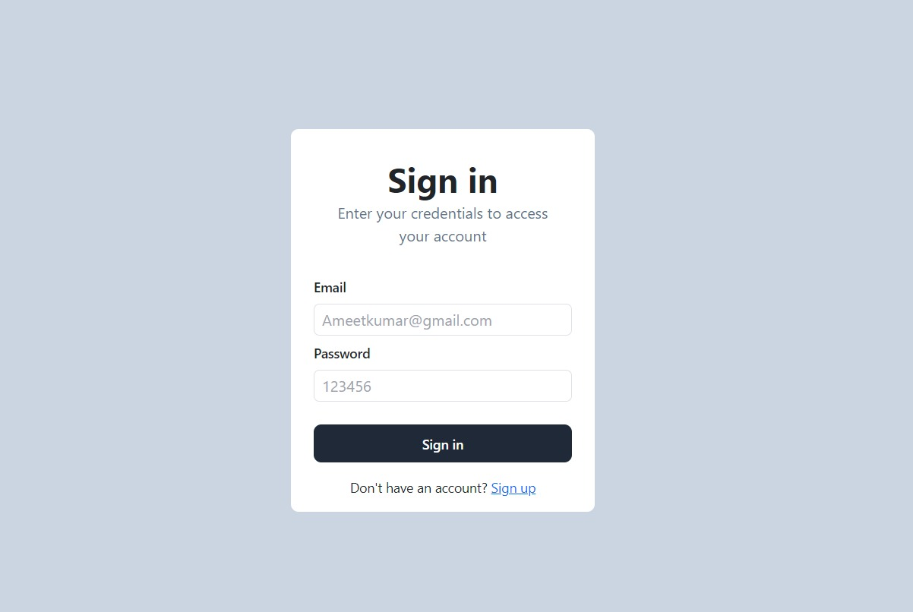
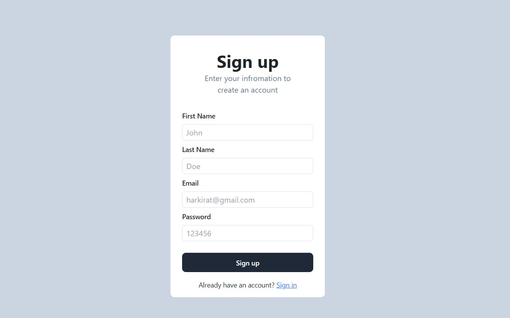

# Paytm Project

This project is a simplified version of the Paytm application, built using the **MERN stack** (MongoDB, Express.js, React.js, and Node.js). It allows users to perform basic operations such as account creation, login, checking balance, transferring money, and signing out.

## Features

- **User Authentication**:
  - Create an account (Signup)
  - Login (Signin)
  - Secure authentication using **jsonwebtoken**

- **User Operations**:
  - Fetch account balance
  - Transfer money to other users
  - Logout functionality

## Tech Stack

- **Frontend**:
  - React.js
  - Tailwind CSS
  - Axios (for API communication)

- **Backend**:
  - Node.js
  - Express.js
  - MongoDB (Database)

- **Libraries**:
  - Zod (for input validation)
  - Jsonwebtoken (for secure user sessions)

## Project Structure

### Backend
```
Backend/
|-- routes/
|   |-- Account.js
|   |-- index.js
|   |-- user.js
|-- config.js
|-- db.js
|-- index.js
|-- middleware.js
|-- package.json
```

### Frontend
```
Frontend/
|-- public/
|-- src/
|   |-- assets/
|   |-- components/
|       |-- Appbar.jsx
|       |-- Balance.jsx
|       |-- Button.jsx
|       |-- ButtonWarning.jsx
|       |-- Dashboard.jsx
|       |-- Heading.jsx
|       |-- InputBox.jsx
|       |-- SendMoney.jsx
|       |-- Signin.jsx
|       |-- Signup.jsx
|       |-- Spinner.jsx
|       |-- SubHeading.jsx
|       |-- User.jsx
|       |-- Users.jsx
|   |-- App.jsx
|   |-- index.css
|   |-- main.jsx
|-- package.json
|-- tailwind.config.js
```

## How to Run

### Prerequisites
- Node.js
- MongoDB

### Setup

1. Clone the repository:
   ```bash
   git clone <repository-url>
   ```

2. Navigate to the project directory:
   ```bash
   cd Paytm
   ```

3. Install dependencies for both backend and frontend:
   ```bash
   cd Backend
   npm install
   cd ../Frontend
   npm install
   ```

4. Configure environment variables for the backend:
   - Create a `.env` file in the `Backend` directory.
   - Add the following:
     ```env
     PORT=5000
     MONGO_URI=<your_mongo_db_connection_string>
     JWT_SECRET=<your_jwt_secret>
     ```

5. Start the backend server:
   ```bash
   cd Backend
   npm start
   ```

6. Start the frontend development server:
   ```bash
   cd Frontend
   npm run dev
   ```

7. Access the application at `http://localhost:5173` (default port for Vite).

## Screenshots

### Signin Screen



### Signup Screen



## Future Improvements

- Implement transaction history
- Add profile management
- Integrate notifications for successful transactions


